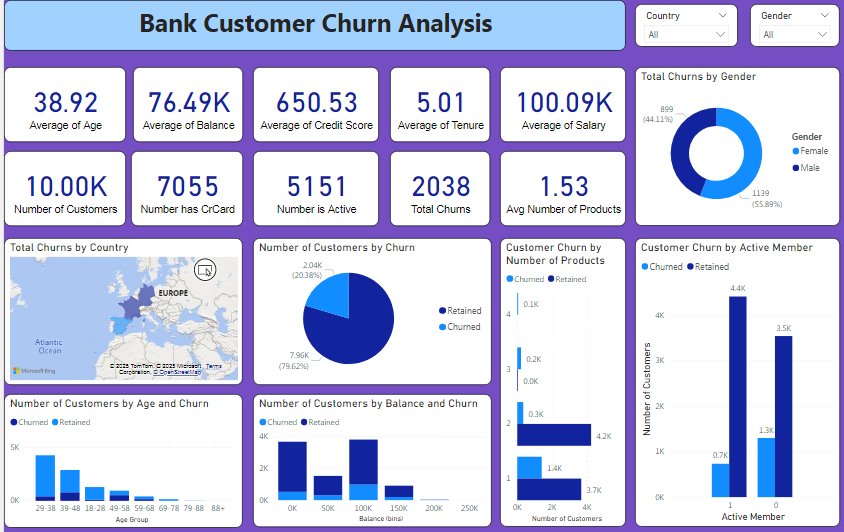

# Bank-Customer-Churn-Analysis

## I. Introduction
The project aims to build a churn analysis dashboard system for banking customers to help businesses identify customer groups at high risk of leaving, understand their behavioral characteristics, and develop appropriate retention strategies. This dashboard helps sales and customer care departments make faster decisions based on real data, while improving customer retention and optimizing marketing costs.

## Data source
For the data source, get the dataset here: [LINK](https://drive.google.com/file/d/1SWjBoeVXciPHSzmW0SzFxUcAk4V7-KuE/view?usp=drive_link)

And here is the data description:
- RowNumber: The index of the row
- CustomerID: A unique ID assigned to each customer
- Surname: The last name of the customer
- CreditScore: A numerical score representing the customer's credit-worthiness (higher score indicates better credit history)
- Geography: The country where the customer lives (e.g., France, Germany, Spain)
- Gender: The gender of the customer (Male/Female)
- Age: The age of the customer in years
- Tenure: The number of years the customer has been with the bank
- Balance: The current balance in the customer's account
- NumOfProducts: The number of bank products the customer is using (e.g., saving accounts, credit cards...)
- HasCrCard: Whether the customer has a credit card (1 = Yes, 0 = No)
- IsActiveMember: Whether the customer us actively engaging with the bank (1 = Yes, 0 = No)
- EstimatedSalary: The estimated annual salary of the customer
- Exited: Whether the customer has churned (1 = Yes, 0 = No)

## Analyzing Insight & Actionable Insights

### 1. Summary Data
- Key KPIs:
  - Average Age: 38.92 years old
  - Average Balance: 76.49K
  - Average Credit Score: 650.53
  - Average Tenure: 5.01 years
  - Average Salary: 100.09K
  - Average number of products: 1.53
- Customer Information:
  - Total Customers: 10,000
  - Number with Credit Card (HasCrCard): 7,055
  - Number Active (IsActiveMember): 5,151
  - Total Customer Who Have Left (Exited): 2,038 -> Churn Rate ~ 20.38%

### 2. Summary Insights
- Churn status:
  - High churn rate (20.38%), meaning about 1/5 of customer have left.
  - Churn is distributed by:
    - Gender: Female accounts for ~ 56%, Male ~ 44% of customers who no longer use any bank services.
    - Active status:
      - Active(1): 0.7K churn
      - Not active(0): 1.3K churn
      => Non-active customers have a significant higher churn rate
    - By age:
      - The age group from 39-48 and 49-58 have the highest churn (804 and 532 people respectively)
      - The younger (18-28) and older (69+) groups have low churn
    - By Number of Products:
      - Customer with 1-2 products are the main churn group
      - The group with 3+ products churns much less, but the number of retained customers also really low. In particular, the group of 4 products had no retained customers, showing an almost absolute churn potential.
    - By account balance:
      - Customers with balance from 100K-150K churn the most.
    - By countries (map):
      - Churn is distributed by European countries. Specifically, France and Germany have the highest churn rate, with 811 and 814 people. Meanwhile, Spain has the lowest churn, with only 413.

### 3. Actionable Insights
